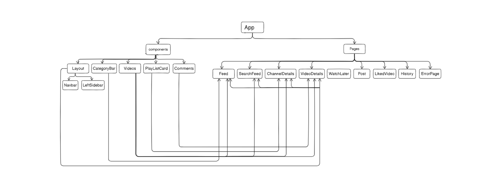
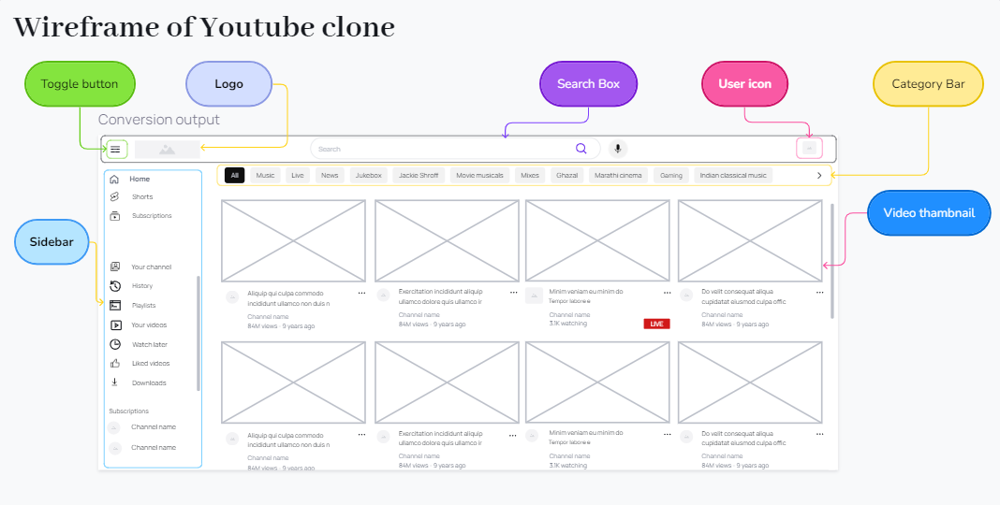

# PlayTube

PlayTube is a React project inspired by the popular YouTube video application. This project showcases features such as video listing, playback, login, signup, video watchlist, and video recommendations.

## Features

- **Video Listing**: Browse and search for videos.
- **Video Playback**: Watch videos with a built-in player.
- **User Authentication**: Secure and reliable login and signup using Firebase Authentication.
- **Video Watchlist**: Save videos to your personal watchlist.
- **Recommendations**: Get video recommendations based on your preferences.

## Technologies Used

- **React**: For building the user interface.
- **Vite**: For creating the React project.
- **TailwindCSS & JSX**: For UI design.
- **React Redux**: For global state management.
- **Firebase**: For authentication and cloud storage.
- **Axios**: For API requests.
- **React Icons**: For displaying icons.
- **React Player**: For video playback.
- **React Router Dom**: For navigation and routing.
- **React Toastify**: For displaying notifications.

## Getting Started

### Prerequisites

Ensure you have the following installed:

- [Node.js](https://nodejs.org/)
- Visual Studio Code (or any other code editor)

### Setup the React Project

1. **Create the React project using Vite:**

   ```bash
   npm create vite@latest playtube
   ```

2. **Install the necessary dependencies:**
   ```bash
   npm install react-redux @reduxjs/toolkit axios firebase react-icons react-player react-router-dom react-toastify
   ```

### Setup Firebase

1. **Create a Firebase account and project:**

   - Go to the [Firebase Console](https://console.firebase.google.com/).
   - Create a new project.

2. **Get your Firebase project configuration:**

   - Navigate to Project Settings.
   - Copy the Firebase SDK snippet (API keys and other configuration details).

3. **Store the Firebase configuration in your project:**
   - Create a file in your React project (e.g., `firebaseConfig.js`).
   - Add your Firebase configuration to this file.

### Running the Project

To start the development server, run:

```bash
npm run dev
```

## Project structure

App │ └─── src │ └─── pages │ ├── Feed.jsx │ │ ├── CategoryBar.jsx │ │ └── Videos.jsx │ ├── ChannelDetails.jsx │ │ ├── Videos.jsx │ │ └── PlayListCard.jsx │ ├── ErrorPage.jsx │ ├── History.jsx │ ├── LikedVideo.jsx │ ├── Post.jsx │ ├── SearchFeed.jsx │ │ └── Videos.jsx │ ├── VideoDetail.jsx │ │ ├── Comments.jsx │ │ └── Videos.jsx │ ├── WatchLater.jsx │ └─── components ├── CategoryBar.jsx ├── Videos.jsx │ └── VideoCard.jsx ├── PlayListCard.jsx ├── Comments.jsx ├── SuggestionPage.jsx │ └── Searchbar.jsx ├── Layout.jsx │ ├── Navbar.jsx │ ├── LeftSidebar.jsx │ └── Outlet ├── Navbar.jsx │ ├── Searchbar.jsx │ ├── SuggestionPage.jsx │ └── SettingSidebar.jsx ├── SearchBar.jsx │ └── SuggestionPage.jsx ├── SettingSidebar.jsx │ └── SettingSidebarOption.jsx ├── ChannelCard.jsx ├── Loader.jsx └── AuthenticationPage.jsx

## Entity Relation Diagram (ER Diagram)



## Wireframes diagram of home page



## Figma design of project

[Figma](https://www.figma.com/design/TZAUBmSHU8NzM21COmX4sQ/Untitled?node-id=0-1&t=NqWqvWAlpbvAWgnz-1)

## Project Link

Check out the live project: [PlayTube](https://playtubevid.netlify.app/)
